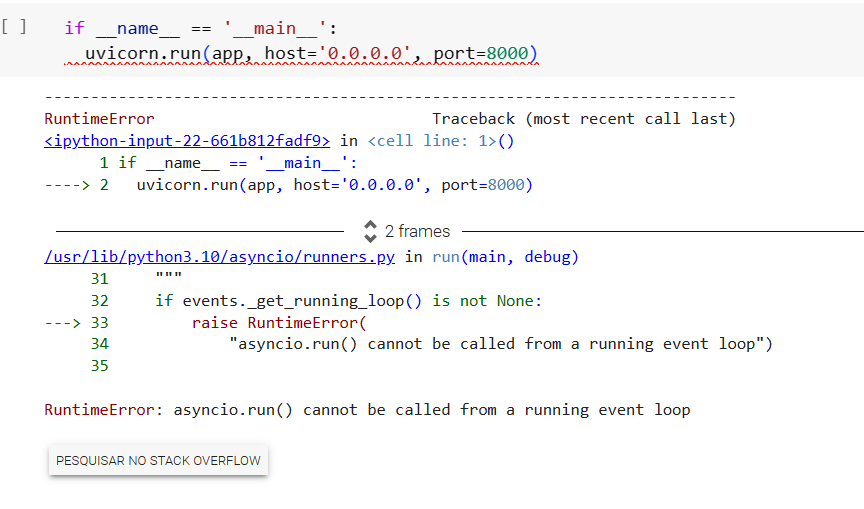

# Atividade 3: Deploy de modelo de Machine Learning na Nuvem

####  Autor: Alysson Cordeiro - Engenheiro da Computação - M7
Construção e deploy de um modelo de classificação criados pelos alunos. Este modelo deve ser deployado em uma nuvem comercial e uma API de acesso a ele deve ser desenvolvida.
## INTRODUÇÃO
Eu devo escolher um conjunto de dados dentre os relacionados abaixo. Qualquer conjunto diferente destes deve ser aprovado pelo professor. Devo descrever todas as manipulações realizadas com os dados na documentação do meu projeto. Verá nos blocos seguintes o processo das manipulações.

No tópico tirando do Github da atividade **"O conjunto de dados que escolhido será usado para a construção de um modelo de predição ou classificação. Deverá construir o modelo utilizando o Python e o framework de Machine Learning de minha preferência."**
Eu escolhi um dataset diferente que foi sugerido pelo professor, o quais eram:
- Flight Delay
- Brazil: Total highway crashes 2010 - 2023
- Customer Segmentation
- Startups
- Phone Activity Detailed Data
- Global YouTube Statistics 2023
  
O dataset escolhido foi o sobre caso de COVID-19 na cidade de Toronto, Canadá. Cujo objetivo era prever a categoria de um caso de COVID-19 em Toronto. 

#### Motivo da escolha do Dataset:

**Foi escolhido esse Dataset pelo motivo de eu, aluno Alysson Carlos de Castro Cordeiro, não saber como lidar e tampouco começar um pré-processamento de dados. Houve tentativa de pedir ajuda aos colegas de classe, contudo sem exito. Então, tive que procurar um curso extensivo na plataforma Youtube para iniciar o aprendizado e tentar dar uma entrega ao mínimo satisfatória, a qual os avaliadores possam também avaliar o esforço do desenvolvimento. Dessa forma, de vários vídeos de pré-processamento, o mais completo foi do canal** (clique aqui) **[Synapse Data Science](https://youtu.be/VxHFJd83S5Q?si=zdPyNIIdRv03Ce71).** **Neste link, demonstra passo a passo do pré-processamento usando o Dataset do Kaggle [Covid-19 Toronto](https://www.kaggle.com/datasets/divyansh22/toronto-covid19-cases).**

## SOBRE O DATASET:


**OBJETIVOS**

O objetivo é prever se um dia específico terá um número de casos de COVID-19 acima ou abaixo da média. Este dataset contém informações sobre casos de COVID-19 em Toronto, Canadá, o qual foi coletado pelo governo de Toronto e é atualizado diariamente. O tamanho do dataset: 1.242.803 casos.

**COLUNAS E PARÂMETROS**

O dataset contém algumas colunas relevantes para o que estamos querendo prever como as seguintes colunas, por exemplo:

- **date**: A data do caso, morte ou internação.
- **case_type**: O tipo de caso, morte ou internação.
- **age_group**: O grupo de idade do indivíduo.
- **gender**: O sexo do indivíduo.
- **neighbourhood**: O bairro do indivíduo.
- **source**: A fonte do caso, morte ou internação

**OBJETIVO DA PREVISÃO**

O objetivo da previsão é prever o número de casos, mortes ou internações por COVID-19 em Toronto. Para esse tipo de problema, a classificação é o tipo de modelo de aprendizado de máquina mais adequado.

**CLASSIFICAÇÃO OU REGRESSÃO?**

O objetivo do projeto é prever se um dia específico terá um número de casos de COVID-19 acima ou abaixo da média. Para esse tipo de problema, a classificação é o tipo de modelo de aprendizado de máquina mais adequado. Isso ocorre porque estou tentando prever uma categoria, ou seja, se o número de casos será alto ou baixo.

A regressão seria mais apropriada se você estivesse tentando prever um valor numérico, como o número exato de casos de COVID-19 em um determinado dia.

### PRÉ-PROCESSAMENTO

***Etapas***

As seguintes etapas de pré-processamento foram realizadas:

1. **Remoção de dados ausentes:** 637 linhas foram removidas do dataset porque continham valores ausentes.
2. **Remoção de colunas desnecessárias:** Três colunas foram removidas do dataset porque não eram relevantes para o objetivo do projeto:
   - Age Group
   - Reported Date
   - _id
  ```python
  dado = dado.drop(columns=['Age Group', 'Reported Date', '_id'])
  ```
3. **Codificação de dados categóricos:** Os dados categóricos foram convertidos em dados numéricos usando a codificação de valores únicos ('yes' para 1 e 'no' para 0).
```python
cols_to_convert = [
    'Currently Hospitalized',
    'Currently in ICU',
    'Currently Intubated',
    'Ever Hospitalized',
    'Ever in ICU',
    'Ever Intubated'
]
dado.loc[:, cols_to_convert] = dado.loc[:, cols_to_convert].replace({'Yes': 1, 'No': 0})
```

4. **Invertendo os valores das colunas strings:** Os valores das colunas Classification, Client Gender e Outcome foram invertidos.

```python
dado.loc[:, 'Classification'] = dado['Classification'].replace({'CONFIRMED': 1, 'PROBABLE': 0})
dado.loc[:, 'Client Gender'] = dado['Client Gender'].replace({'MALE': 1, 'FEMALE': 0})
dado.loc[:, 'Outcome'] = dado['Outcome'].replace({'RESOLVED': 1, 'FATAL': 0})
```

### MODELO

### **Primeiramente, foi usando Collab Google, pois o vs code não reconhecia o Pycaret mesmo eu tendo uma versão de Python compatível que é python versão 3.6 ou superior. Na máquina está 3.11.**


O modelo foi desenvolvido usando a biblioteca PyCaret, visto que ajuda na facilidade de uso, na aceleração de desenvolvimento, na variedade de algoritmos. Além de hiperparâmetro automatizado, entre outros.

**Configuração**

instalação:
```python
!pip3 install pycaret[full] #usar a versão completa
```
```python
import pandas as pd
import numpy as np
from unidecode import unidecode
```

O modelo foi configurado da seguinte forma:

-  dataset tratado (pre-processamento.ipynb) .
  
```python
df = pd.read_csv('/content/pre-processed_data_COVID19.csv')
df.head()
```

- fazendo as immportações de classificação do pycaret. O target foi definido como a coluna Classification.


- A GPU foi habilitada para acelerar o treinamento do modelo.
  
- Duas colunas foram ignoradas porque não eram relevantes para o objetivo do projeto: Source of Infection e Outbreak Associated. Usando a função
  
```python
evaluate_model(melhor_modelo)
```
pois estava dando importancia demais, com isso estava mostrando que o melhor modelo era o **Logistic Regression** com uma acuracia de 92,58% mas com Recall de 100%


### TREINAMENTO

```python
melhor_modelo = compare_models()
```
Com isso, após a ignorar duas features, consegui ter uma visão melhor sobre as comparações. Logo, mostrou que o melhor modelo seria **Gradient Boosting Classifier** com uma acuracia de 92,61% de acertos e Recall de 99%. 


Contudo, se caso repararmos na figura seguinte vemos que o **Random Forest** seria mais enviavel devido a acuracia de 91% e recall mais baixo.

.png)

### SALVANDO O MODELO PARA O API


###  CONSTRUINDO MINHA API

Primeiramente, houve problemas para gerar a API no fastAPI. Tentei gerar no VS Code, mais o pycaret não funciona. Mesmo tendo uma versão compativel, o sistema diz que não é compatível.

O pycaret funciona no Colab, mas de maneira limitada. A função create_api não existe mais no pycaret. Logo tive fazer a mão. Funcionou de algumas parte, mas não rederizou minha página localhost:8000. Verá a seguir:

Instalação:
```python
!pip install pycaret[full] fastapi
!pip install uvicorn
pip install 'uvicorn[standard]'
```
Apos instalação, importe as bibliotecas necessárias:
```python
import pandas as pd
from pycaret.classification import *
from fastapi import FastAPI
from pydantic import BaseModel
import uvicorn
import joblib
```

Use a função para criar o arquivo pkl:

```python
model = load_model('modelo_2')
```

Use esse código para rederizar o API.
```python
app = FastAPI()

class InputData(BaseModel):
    feature1: float
    feature2: float

@app.post("/predict/")
async def predict(data: InputData):
    try:
        input_data = {
            'feature1': data.feature1,
            'feature2': data.feature2
        }


        prediction = predict_model(model, data=input_data)


        return {'prediction': prediction['Label'][0]}
    except Exception as e:
        return {'error': str(e)}
```

E para iniciá-lo finalize executando o código:

```python
if __name__ == '__main__':
  uvicorn.run(app, host='0.0.0.0', port=8000)
```

Contudo a partir daqui sou impedido de fazer qualquer coisa com minha API. Pois não reconhece a inicialização. Veja embaixo:



Fala que o erro "RuntimeError: asyncio.run() cannot be called from a running event loop" ocorre porque você está tentando usar `asyncio.run()` dentro de um ambiente que já possui um loop de eventos em execução. Isso geralmente acontece quando você tenta executar código assíncrono dentro de outro contexto assíncrono. Entretanto, não há outro loop em excução.

Então para isso, a unica solução foi o serviço Ngrok que é uma ferramenta que permite criar túneis seguros para tornar aplicativos locais acessíveis pela Internet. Ele é especialmente útil durante o desenvolvimento e testes de aplicativos web, pois permite que você compartilhe temporariamente um servidor web local com outras pessoas ou sistemas externos, mesmo quando esse servidor está atrás de um firewall ou NAT.

Mas ao tentar instalar o usar com código Ngrok mostra erro


O erro que você está enfrentando parece estar relacionado a algum problema com a configuração do túnel do Ngrok. Ao pesquisar sobre o erro, na qual dizia que o serviço Ngrok deve ser instalado com python versão mais baixa. Contudo, se caso instalar a versão mais baixa irá desconfigurar o pycaret.